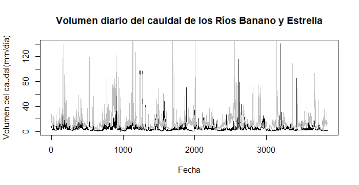
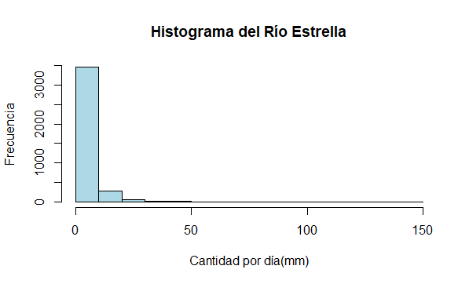
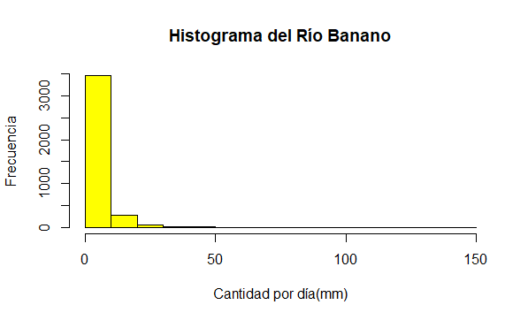

# **Tarea 2. Exploración de Datos. Tarea sobre datos hidrológicos.**  

# Procesamiento de Datos.  Andy Johel Valverde Ledezma  

## **Gráfico de caudales.**
plot(inp[,2],
     main = "Volumen diario del cauldal de los Ríos Banano y Estrella",
     type = "l", col="black", xlab = "Fecha",
     ylab = "Volumen del caudal(mm/día)")
lines(inp[,3],
      col="grey")
      

## Estadistica de los caudales de estos dos ríos
summary(inp[,2:3])

### Histograma para Río estrella
hist(inp[,2], col = "Lightblue", 
     main = "Histograma del Río Estrella", 
     xlab = "Cantidad por día(mm)",
     ylab = "Frecuencia")

### Histograma para Río babano
hist(inp[,2], col = "yellow", 
     main = "Histograma del Río Banano", 
     xlab = "Cantidad por día(mm)",
     ylab = "Frecuencia")

## Asociamos nombre a los ríos
names(inp) <- c("fecha","estrella","banano")
attach(inp)

#### Para probar si funcionó lo anterior usamos un plot
plot(estrella, col="black")

## Definir la fechas en días, meses y años
Tempdate <- strptime(inp[,1], format= "%d/%m/%Y")

## Añadir los datos de volumen anual de los ríos a una carpeta
MAQ_estrella <- tapply(estrella, format(Tempdate, format="%Y"), FUN=sum)
MAQ_banano <- tapply(banano, format(Tempdate, format="%Y"), FUN=sum)

### Exportamos los datos anuales
write.csv(rbind(MAQ_estrella,MAQ_banano), file="MAQ.csv")

##### Gráfico con los datos del volumen anual de los ríos
plot(MAQ_banano,
     ylim=c(475,3000), col="blue",
     main = "Volumen anual de los Ríos Banano y Estrella",
     xlab = "Fecha",
     ylab = "Volumen Anual")
lines(MAQ_estrella, col=1)
legend(x="topright",
       inset = 0.05, legend = c("Estrella","Banano"),
       fill = c("Black","blue"), horiz = FALSE)

## añadir los datos de volumen mensual de los ríos a una carpeta
MMQ_estrella <- tapply(estrella, format(Tempdate, format="%m"), FUN=sum)
MMQ_banano <- tapply(banano, format(Tempdate, format="%m"), FUN=sum)

### exportamos los datos mensuales
write.csv(rbind(MMQ_estrella,MMQ_banano), file="MMQ.csv")

## Analisis de correlacion
### Utilizaremos la función cor para obtener datos que muestran correlación
corinp <- cor(inp[,2:3],method= "spearman")
plot(estrella, banano)

inp.lm <- lm(inp[,2] ~ inp[,3], data=inp)
summary(inp.lm)

## graficos de correlacion
plot(inp.lm)

